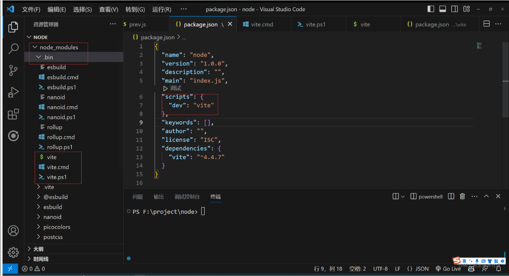

<PageHeader content="npm run xxx 的工作流程" />

## npm run 的工作流程

1. 假设现有一个项目，项目根目录下有一个 package.json 文件，其中包含一个 "dev" 指令 ：


2. 执行 `npm run dev` 命令：
   - npm 会先从当前项目的 node_modules/.bin 去查找可执行命令 vite
   - 如果没找到就去全局的 node_modules 去找可执行命令 vite
   - 如果还没找到就去环境变量查找
   - 再找不到就进行报错

## npm 生命周期

::: warning npm 生命周期

npm 生命周期分为 3 个阶段：

- pre：在运行指令前执行
- run：运行指令
- post：在运行指令后执行

```json
{
  "scripts": {
    "predev": "echo 打包前",
    "dev": "vite",
    "postdev": "echo 打包后"
  }
}
```

:::

## 可执行命令文件: .sh、.cmd、.ps1

::: danger .sh && .cmd && .ps1 可执行命令文件

由于 nodejs 是跨平台的，所以它的可执行命令兼容各个平台:

- .sh 文件是 Linux、macOS、Unix 下的可执行文件
- .cmd 文件是 Windows 下的可执行文件
- .ps1 是 PowerShell 下的可执行文件



:::

## npx 如何执行项目中的可执行文件？

在 Node.js 中， `npx` 是一个 npm 包执行工具，它允许你在不安装全局包的情况下直接运行项目中的可执行文件。像这样

```sh
# npm i -g vitest
npm i -D vitest
npx vitest # 即使你没有全局安装 vitest 也可以运行
```

这对于执行临时任务或者尝试新的包非常方便。
